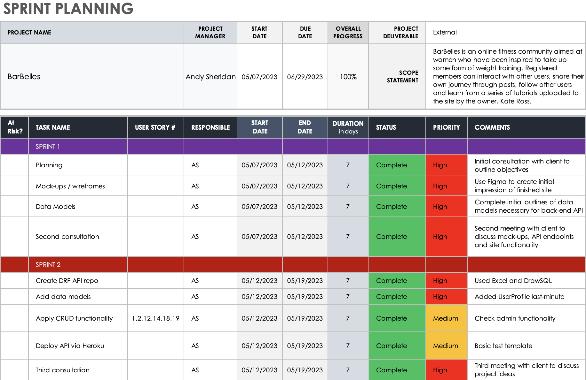
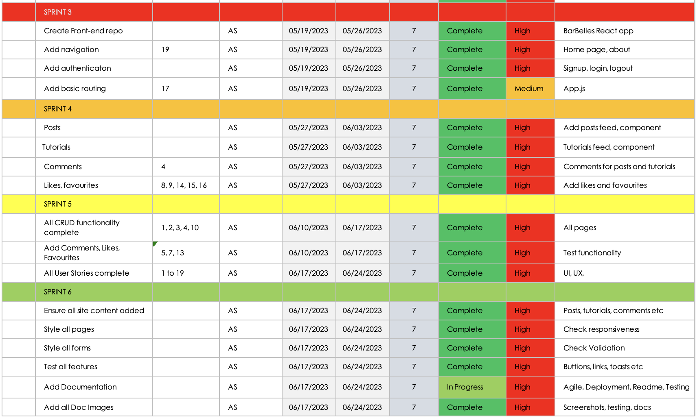
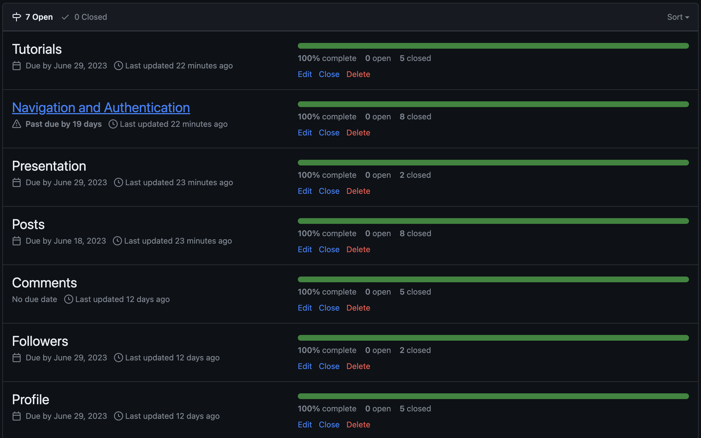
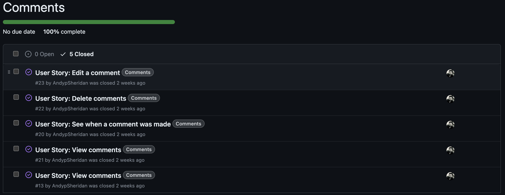
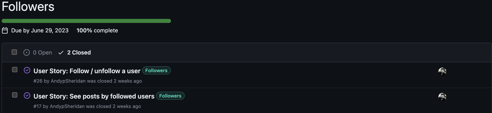
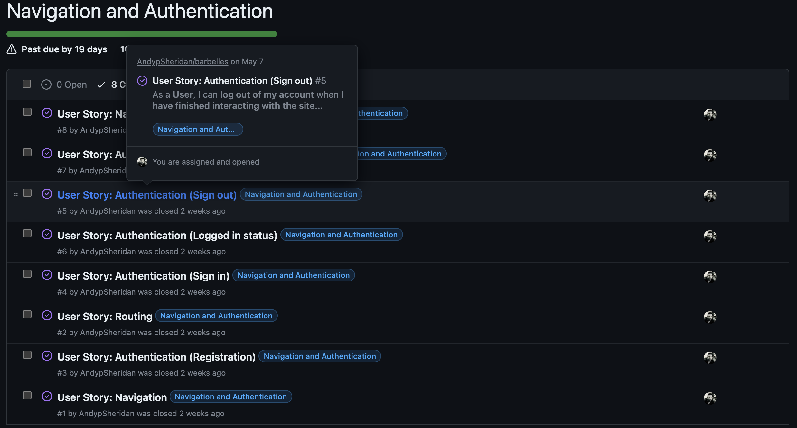
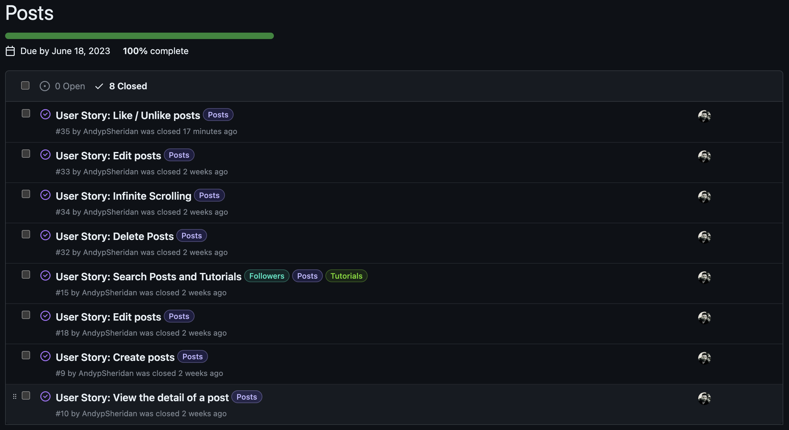
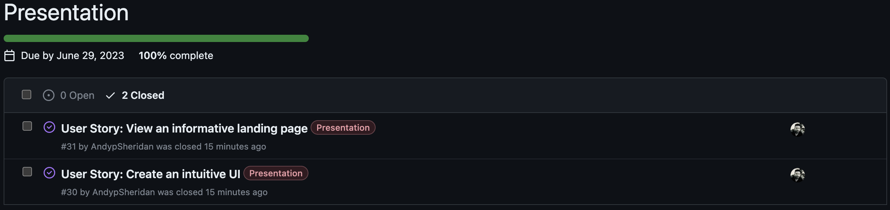
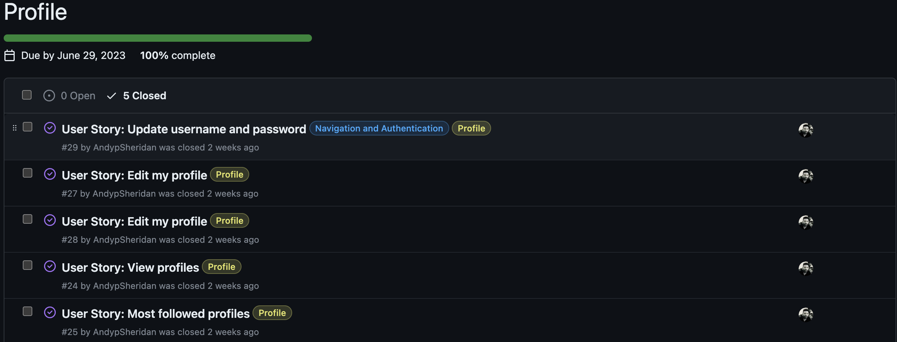
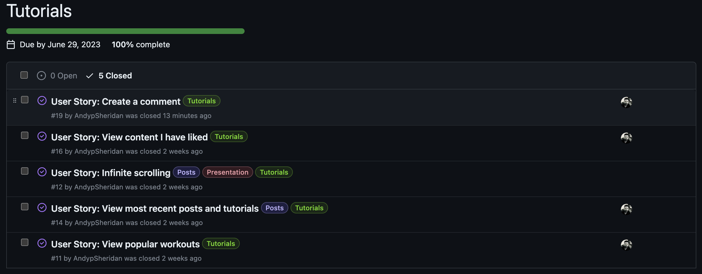

# Agile Methodologies

* **Agile Methodologies**
  * [Overview](#overview)
  * [Sprint Notes](#sprint-notes)
    * [Sprint 1](#sprint-1)
    * [Sprint 2](#sprint-2)
    * [Sprint 3](#sprint-3)
    * [Sprint 4](#sprint-4)
    * [Sprint 5](#sprint-5)
    * [Sprint 5](#sprint-6)
  * [Epics](#epics)
  * [Learning Outcomes](#learning-outcomes)

## **Overview**

This was my second project developed using Agile Methodologies and I encountered challenges, and some occasional confusion, along the way. The first challenge was the plethora of information I had absorbed in a short space of time. I was attempting to apply a number of Agile methods and use various different platforms to help the planning process: 

I used a [Smart Sheet](https://www.smartsheet.com) template to help plan six sprints for this project:

I used the Github [project board](https://github.com/users/AndypSheridan/projects/3) to create and track issues and User Stories. I then integrated these within my Smart Sheet template.

This proved instrumental in keeping me focused on tasks and creating the necessary features for the project. As this was only my second experience of using Github projects, I found that on several occasions I underestimated or overestimated the amount of time and/or tasks for each particular sprint but, on the whole, the schedule worked well. Using the Milestones feature I created Epics in Github and to these I added my User Stories, although I had already begun work on the by this point. I also created labels for the project was extremely helpful when it came to prioritising requirements for the project. 

It has been a steep learning curve, and I felt that my plan was continually evolving rather than being something I rigidly adhered to. On reflection, I consider this to be a good thing in some respects.

Sprints 1 and 2 were where I carried out all of the work on the API and I have outlined a brief summary of these below. They are also detailed in the AGILE.md file in the back-end [GitHub Repository](https://github.com/AndypSheridan/barbelles-api/blob/main/AGILE.md)

### *Sprint 1*

* 7th - 12th May
  * Planning phase

The purpose of this five day sprint was to thoroughly plan the project. This involved an initial meeting with the client, Kate Ross, to discuss her expected outcomes of the project. This was the first in a series of highly productive meetings where we looked at core functionality of what the finished site might have. Miss Ross was hoping to be the owner of a content-sharing website where female clients could share their fitness journeys away from the regular social media sites, thus creating a more private community. The outcome of this meeting was that the finished site would implement the following features: user posts, tutorials provided by the site owner, the facility to comment on both tutorials and posts, to like and save both, as well as a feature for users to follow other members of the community and view posts by those they follow.

This meeting was instrumental in determining the database models to be used in the project, see below:

We settled on nine models to provide the features that had been discussed. At the end of the sprint, a second meeting with the client was arranged where we decided we were happy that these models would be sufficient and it was time to move on to the next sprint.

### *Sprint 2*

* 12th - 19th May
  * Sprint two was slightly longer and the intention was to start and finish work on the API.

With the data models in place, work on the back-end started well, gradually building out the functionality for actions that would be performed by the user on the front-end. CRUD functionality for all agreed features was in place, and all API endpoints were covered. Details of the back-end-only testing can be found [here](/TESTING.md)

In order for the front-end to connect to the API, it was also necessary to deploy the API via Heroku. This is a fairly lengthy process which is detailed [here](/DEPLOYMENT.md)

At the end of this sprint, a third consultation where I demonstrated the functionality of the deployed API, helping the client visualise how this would translate to actions performed on the front-end site.

This concluded sprint two; further details of subsequent sprints and the entire process can be found in the Readme for the front-end project.

### *Sprint 3*

* February 24-28 2023
  * Create basic structure of site and test content for each page

Sprint 3 involved developing views, templates and urls for the main pages of the site. This is when the project board became an invaluable reference point. There were two occasions when the project as a whole seemed quite overwhelming but the project board helped to keep me focused. I did find that I had not been specific enough with some user stories so I edited these and added several more as I became more familiar with the process. This sprint finished ahead of schedule on the 27th.

### *Sprint 4*

* March 1-5 2023
  * Add background images, add content for User to view, set up layout for all pages

Sprint 4 took slightly longer than expected. The purpose of this was to add all background images and provide the User with a front end method to upload book photographs. Due to some image size and resolution issues, plus a lack of familiarity with the Cloudinary platform, it took longer than expected to achieve, so I finished this sprint on the 7th March.

### *Sprint 5*

* March 7-14 2023
  * Enable CRUD functionality where necessary, add User profile

I allowed a week for sprint 5. The purpose was to add all site content, navigation and ensure CRUD functionality worked in all instances where the admin or user needed it. These included adding a comment or review and editing or deleting a review. Initially I was ahead of schedule, but progress was significantly disrupted when it came to adding a user profile so this meant the sprint was not finished until the 15th March.

### *Sprint 6*

* March 16-23 2023
  * Ensure all user stories actioned, finalise styling of all content, forms and pages

This was another week-long sprint. With all User Stories working as intended, the aim of this sprint was to refine the appearance of the site and perform testing. In a meeting with my mentor towards the end of the sprint, some minor styling issues were identified, all subsequently actioned. A major problem came when setting debug=False in the settings.py file. The project then failed to deploy or if it did, there would be no access to my static files. This wasted a crucial day of the project and put me slightly behind. I finished this sprint on the 24th.

## **Epics**

To assist with the development process of the project, it was divided into seven Epics using Github Milestones: each representing a feature of the project as a whole. All User stories were assigned to an Epic and are summarised below.

 

### 1. Comments

All CRUD functionality for comments on both posts and tutorials.

 

### 2. Followers

All CRUD functionality for the followers feature.

 

### 3. Navigation and Authentication

All User Stories relating to navigating the front-end site as well as signing up, signing and signing out are grouped in the Epic below:

 

### 4. Posts

All CRUD functionality for the posts feature.

 

### 5. Presentation

Presentation-related User Stories were linked to this milestone.

 

### 6. Profiles

All CRUD functionality for the profiles feature.

 

### 7. Tutorials

All CRUD functionality for the tutorials feature.

 

## Learning Outcomes

I have enjoyed this project and it has been a wonderful learning experience. I think this second attempt using Agile methodologies has set me on a course I look forward to refining and developing continually. Working on a back-end and front-end to deliver an overall project has been enormously challenging but the methodologies outlined in this file have helped keep me focused and on-track even when it has felt overwhelming at times.

[Back to Readme](/README.md)