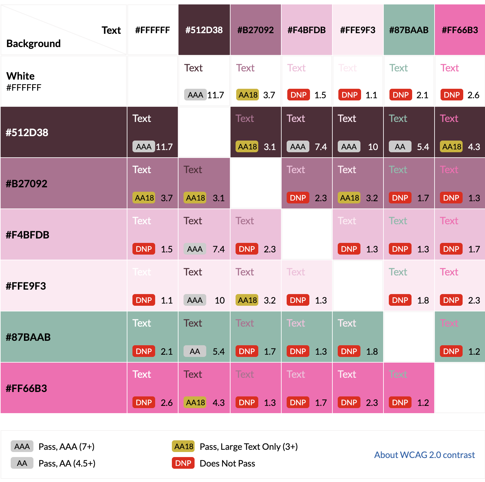
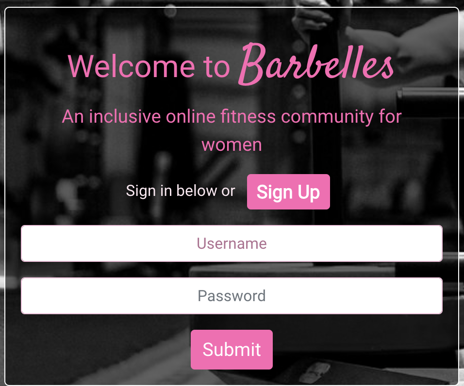
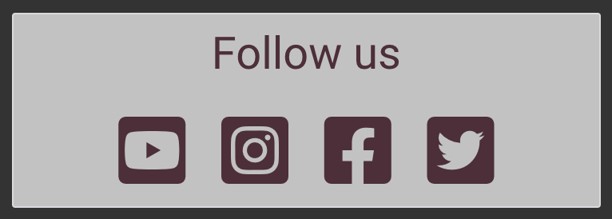

# **BarBelles**
## **Site Overview**

BarBelles is an online fitness community for women. This project, developed using ReactJS, aims to provide women with a safe and inclusive space to share their own personal fitness journeys as well as the opportunity to learn and interact with others in the community. Users can read posts by others, create, update and delete their own posts as well as follow other users. There is also the facility to add, view, edit or delete comments. Users can learn from video Tutorials added by the site owner, Kate Ross; only users with staff privileges can create, edit or delete tutorials but all users can 'favourite' them and add comments. 

BarBelles serves as a front-end component which is connected to the [BarBelles API backend](https://github.com/AndypSheridan/barbelles-api), developed using Django Rest Framework.

- Click [here](https://barbelles.herokuapp.com/) to view the final deployment of the front-end site.
- Click [here](https://barbelles-api.herokuapp.com/) to view the final deployment of the API.
- Click [here](https://github.com/AndypSheridan/barbelles-api) to view the API repository.

## Table of contents:
1. [**Site Overview**](#site-overview)
1. [**Planning stage**](#planning-stage)
    * [**Strategy**](#strategy)
      * [***Site Aims***](#site-aims)
      * [***Target Audiences***](#target-audiences)
      * [***User Stories***](#user-stories)
    * [***Wireframes***](#wireframes)
    * [***Database Schema***](#database-schema)
    * [***Colour Scheme***](#color-scheme)
    * [***Typography***](#typography)
1. [**Agile Development**](#agile-development)
1. [**Features**](#features)
    * [***Navbar***](#navbar)
    * [***Account Pages***](#account-pages)
      * [***Sign Up***](#sign-up)
      * [***Sign In***](#sign-in)
      * [***Sign Out***](#log-out)
    * [***About Page***](#about-page)
    * [***Social Media Links***](#social-media-links)
    * [***Posts Pages***](#home-page)
    * [***Post Detail***](#books-page)
    * [***Tutorials Pages***](#book-detail-page)
    * [***Tutorial Detail***](#book-detail-page)
    * [***Profile Pages***](#edit-book-page)
    * [***Delete Book Page***](#delete-book-page)
    * [***Authors Page***](#authors-page)
    * [***Author Detail Page***](#author-detail-page)

    * [***Profile Page***](#profile-page)
    
    * [***Toasts***](#messages)
    * [***Defensive Design***](#defensive-design)
    * [***User Authentication***](#user-authentication)
    * [***404 Page***](#404-page)
1. [**Future-Enhancements**](#future-enhancements)
1. [**Testing Phase**](#testing-phase)
1. [**Deployment**](#deployment)
1. [**Software and Tech**](#software-and-tech)
1. [**Media**](#media)
1. [**Credits**](#credits)
1. [**Honourable mentions**](#honorable-mentions)

## **Planning Stage**

### **Site Aims:**

* Develop a colourful, interactive online fitness content-sharing platform for women to come together as a community.
* Connect smoothly and seamlessly to the BarBelles-API back-end.
* Offer the User an easy way to register and login to view site content.
* To provide members of the community with CRUD (create, read, update, delete) functionality for posts found on the site
* Deliver an accessible and easy to navigate site for users on desktop and mobile devices.
* Provide registered, logged-in users with the opportunity share their own fitness journeys.
* Provide users with an opportunity to gain motivation or inspiration by viewing posts added by other members of the community.
* Offer users the opportunity to interact and engage with others by liking and commenting on posts by other users or tutorials added by the site owner.
* Provide filtered content for the User by based on Users they follow or content they have liked or favourited.
* Enhance the user experience by implementing an integrated search function for those trying to find a post tutorial, or user.
* Offer users the opportunity to provide more information about themselves by adding to their user profile.
* Deliver to the user a comprehensive explanation and rationale behind the site through a clear and concise About page. 

### **Target Audiences:**

* Women looking to get into fitness.
* Women who are interested in fitness in general.
* Women who might feel too self-conscious to post about their own fitness experiences on regular social media platforms.
* Women looking for inspiration or motivation from like-minded members of the community.
* Women who would like to interact with and feel part of a community.
* Women would would like to learn from tutorials and workout videos posted by the site owner, Kate Ross.

### **User Stories:**

#### **Site User**
As a **Registered** user I can: 
* *easily login* in order to *access my account*.
* *easily logout* in order to *end my session on the site when I have finished interacting with the content and community*.
* *view a navbar from every page* in order for *navigate easily between pages*.
* *navigate through pages quickly and easily* in order to *view site content seamlessly without page refresh*.
* *tell if I am logged in or not* in order to *log in if necessary*.
* *maintain my logged-in status until I choose to log out* so that *my user experience is not compromised*.
* *create a post* in order to *share my fitness journey with the community*.
* *view the detail of a post* in order to *learn more about it*.
* *edit a post* in order to *update it or make corrections after it has been created*.
* *delete a post I have created* in order to *control my own content*.
* *keep scrolling through posts or tutorials that are loaded automatically* rather *than having to click to the next page*.
* *view a list most recent posts and tutorials in chronological order* in order *to see the most up-to-date content*.
* *search posts and tutorials by keyword* in order to *find content or users*.
* *like or unlike a post* in order to *show appreciation and interact with the community and site content*.
* *view the detail of a tutorial* in order to *learn more about it*.
* *create a comment on a post or tutorial* in order to *interact with the content and community*.
* *view comments on a post or tutorial* in order to *find out what others think of the site content*.
* *edit a comment I have added to a post or tutorial* in order to *make corrections and keep my content relevant*.
* *delete a comment I have added to a post or tutorial* in order to *control my own content*.
* *follow or unfollow a user* in order to *see content from specific users*.
* *see posts by followed users* in order to *see content from specific users and learn about their fitness journeys*.
* *view profiles of other users* in order to *see their content and learn more about them*.
* *view a list of top profiles* in order to *see who is most popular*.
* *edit my profile* in order to *keep my image and bio up-to-date*.
* *update my username and password* in order to *update my display name and secure my account*.

As an **Unregistered** User I can:
* *easily determine the purpose of the site by viewing an About page* in order to *see if I want to register and join*.
* *easily register* in order to *access the features for registered users*.

#### **Site Admin**
As a **Site Admin** I can: 
* *add tutorials* in order to *educate members of the community*.
* *edit tutorials* in order to *keep content up-to-date*.

### **Wireframes**

I used [Figma](https://www.figma.com) to help guide my design process for this project. I wanted to use a programme which would help me visualise the pages a little clearer than Balsamiq Wireframes, which I have used in the past. As images and colours are a key part of this site's look and feel, I wanted to feel happy they worked in planning before committing.

* [Sign in / sign up page](docs/wireframes/barbelles-signin-wireframe.png)
* [Sign in / sign up page - mobile](docs/wireframes/mobile-signup-wireframe.png)
* [About page](docs/wireframes/sfp-about-wireframe.png)
* [Posts / tutorials feed page](docs/wireframes/barbelles-posts-feed-wireframe.png)
* [Posts / tutorials feed page - mobile](docs/wireframes/mobile-posts-feed-wireframe.png)
* [Post / tutorial detail page](docs/wireframes/barbelles-post-detail-wireframe.png)
* [Post / tutorial detail page - mobile](docs/wireframes/mobile-post-detail-wireframe.png)
* [Post / tutorial share page](docs/wireframes/barbelles-share-post-wireframe.png)
* [Post / tutorial share page - mobile](docs/wireframes/mobile-share-post-wireframe.png)
* [Liked posts page](docs/wireframes/barbelles-liked-posts-wireframe.png)
* [Liked posts page - mobile](docs/wireframes/mobile-liked-posts-wireframe.png)
* [Favourited tutorials page](docs/wireframes/barbelles-favourited-tutorials-wireframe.png)
* [Favourited tutorials page - mobile](docs/wireframes/mobile-favourited-tutorial-wireframe.png)
* [Profile page](docs/wireframes/barbelles-profile-page-wireframe.png)
* [Profile page - mobile](docs/wireframes/mobile-profile-page-wireframe.png)
* [Profile edit page](docs/wireframes/barbelles-edit-profile-wireframe.png)
* [Profile edit page - mobile](docs/wireframes/mobile-profile-edit-wireframe.png)

### **Database Schema**

I used [Lucid Chart](https://lucidchart.com/)​ to help visualise my database tables. See the image below:

### **Colour Scheme:**
​
After discussing various options with the site owner this project, we opted for the colour scheme below generated by [Coolors](https://coolors.co/):

About halfway through the project, we agreed the colours worked well, but Miss Ross, felt the site would benefit from the the addition of a brighter shade of pink to make things really stand out. We opted for #FF66B3. We also agreed #FFF (white) would work well in places.

The contrast scores for all the colours used across the project can be seen below. I used [contrast-grid](https://contrast-grid.eightshapes.com/) to generate this chart.

​

#### **Typography**
​
The site owner and I explored a number of options when looking at themes of the site. I used [Font Pair](https://www.fontpair.co/inspiration/space-mono-roboto-mono) to try a number of options and eventually, we settled on the following:

* [Satisfy](https://fonts.google.com/specimen/Satisfy?query=satisfy)
Almost stereotypically feminine, Miss Ross thought this font would reinforce the female-only theme of the site.

* [Roboto](https://fonts.google.com/specimen/Roboto)
Chosen for its softer edges to counter the extravagance of Satisfy. This is the primary font used across the site.

​

## Agile Development

I used Github projects to create and track issues and User Stories. The Agile processes and methodologies can be viewed [here](/AGILE.md)

 

 

# **Features**

## **Site Navigation**

### **Navbar**
​
The Navbar is a bootstrap component which allows a registered User to navigate their way around the site with ease. When logged out, it displays links to the About Page and Sign up. All icons used in the navbar and site-wide are from [Font Awesome](www.fontawesome.com):

 When the User is logged in, it offers navigation to the About page and features dropdown menus to Post, Tutorial and Profile pages as well as the logout button:

To display properly on smaller screens, I used a Bootstrap hamburger menu:

The Posts dropdown menu features links to all posts, posts by community members the logged-in user follows, liked posts and the link for the user to share a post:

The Tutorials dropdown menu features a link to the tutorials feed and tutorials which the logged in user has favourited. For users whose permissions have been set to `is_staff = True` via the API, there will be a link to the share tutorial page:

The final dropdown uses the avatar image of the logged-in user. If no image has yet been added, there is a default image added automatically on registering. There is a link to the Profile page and a sign out button which will trigger a modal asking for sign-out confirmation.

## Account Pages

Upon navigating to the site, the user will find themselves at the landing / sign up / sign in page. The background image is a black and white one of the site owner, Kate Ross pushing a weighted sled:

Options available to the user are:

#### Sign Up

Authentication is handled on the back-end via dj-rest-auth. To create an account, the user must complete this form:

The form will display error messages in several circumstances:

* The User chooses a Username that is already taken
* The password is too easy to guess
* Fields are left blank
* The passwords do not match

See the example below: 

Once the User has successfully registered, they will receive confirmation of registration and be asked to sign in:

#### Sign In

Existing Users can sign in by completing this form:

If the log in details are not valid, an error message is displayed. For example: 

Upon successful sign in, a toast is displayed to provide feedback to the user and they are directed to the Posts page:

#### Sign Out

To sign out of the site and end the current session, the User can navigate to Log Out in the profile dropdown menu in the navbar:

This will trigger the sign out modal asking for confirmation:

The User can cancel this process and go back or click sign out and get redirected to the landing page, where they can sign in again. A toast gives feedback to the user that they have logged out:

#### **Responsiveness**

Here is how the page displays on an iPhone SE:

### Social Media Links

The social media and email icons are situated on the right of the Navbar. The Social Media links are functional and will open in a new tab. 
**NOTE:** There is no actual Social Media Content for this site at the time of writing.

The email icon opens the default email application with the recipient being a test email address for the site.

### About Page

The About page can be viewed regardless of whether the user is logged in or out and displays information about the site. The text welcomes the User to the site and explains what they can do once logged in a registered User.

Towards the bottom of the page, a Social Links component has been used:

Clicking on these links will open a new browser tab on a desktop or laptop whilst on a mobile device, it will open the corresponding app on that device. At the time of writing, we did not have social media links for the site so the links will take the user to the corresponding site's homepage.

#### **Responsiveness**

Here is how the page displays on an iPhone SE. On the smaller screen size:

### **Posts Pages**
#### *All Posts*

The All Posts Page features a list of all posts that have been added to the site by members of the community:

The Posts page is responsive and works well on smaller devices. This is how it looks on an iPhone SE:

Users can search for keywords in posts and usernames using the search function:

When the search bar is active it glows pink:

To the right of the search bar (on large screens), the Social Links component detailed above in the About page is reused. This component will not render on a smaller screen due to the lack of available space. 

The other prominent feature on this page is the Top Profiles component which lists most popular profiles on the site based on the most followers:

On smaller screens, the component is position across the top of the page, beneath the navbar and it shows just the four top profiles:

Clicking on a user's avatar will take you to that particular user's profile page.

#### *Following*

The Following Posts Page is exactly the same as above but it uses a filter that shows posts added by members of the community whom the logged-in user has followed. If the user doesn't follow anybody, the following is displayed:

#### *Liked*

The Liked Posts page uses a different filter which returns results from the API which the logged-in user has liked. If the user hasn't liked any posts yet, the same no-search-results image is displayed.

#### *Share post*

The share post page features a simple form where the user can upload an image, a post title and post story:

On smaller screens, the page looks like this:

The user will receive feedback if they do not submit the form correctly:

There is also a file size-limit of 4096kb which has been set on the back-end. If the user attempt to upload a file larger than that, they will receive another error asking for a smaller size.

In the event of form fields being left blank, the following will be displayed:

To provide additional feedback to the user, If the form is not submitted, an error toast will be shown:

### Post Detail Page

Clicking on a post in any of the above list views will lead to the Post detail page:

This page shows the post itself along with the following:

*Edit post*

The owner of a post will be able to access a dropdown menu situated to the right of the date:

If the user can choose edit and will be taken to the following page which is essentially the same as the share post page:

Upon editing the post, the user will receieve feedback in the form of a toast informing that the post has been updated.

If the user clicks delete, the post will be removed and a toast will confirm this.

*Likes*
If the user likes a post it will display a solid pink heart:

If the user has not liked the post, a pink heart outline will be displayed:

The total number of likes on a post is also displayed.

The number of comments a post has is also shown:

Beneath the post is a form for the logged-in user to add comments:

Upon submitting a comment, the following toast is displayed to the user:

All comments are listed below. A user can edit or delete a comment they have posted using the following dropdown menu:

Choosing edit will display the following form:

Upon a successful edit of the comment, the following toast will provide feedback to the user:

If the user deletes a comment, the following toast is shown:

The Post detail page is responsive and works well on smaller devices. This is how it looks on an iPhone SE:

### **Tutorials Pages**
*Tutorials*

The Tutorials Page features a list of all video tutorials and workouts that have been added to the site owner, Kate Ross, or by approved users who have is_staff set to True on the back-end:

The Posts page is responsive and works well on smaller devices. This is how it looks on an iPhone SE:

Users can search for keywords in tutorials. Here the user is searching for yoga:

In terms of the page layout, it is consistent with the Posts pages, reusing the Top Profiles and Social Media Links to create a familiar UI.

*Favourites*

The favourites page is the same as the Tutorials list, but makes use of a filter function which displays tutorials the user has saved to their favourites.

*Share tutorial*

Users who have the permission, will see the Share tutorial link in the dropdown menu and can add a link to a tutorial or workout, which will be rendered in an iframe. Clicking the link will take them to this page:

On smaller screens, the page looks like this:

### Tutorial Detail Page

Clicking on the pink 'view' link on an individual tutorial in the list view will lead to the Tutorial detail page:

This page shows the post itself along with the following:

*Edit post*

The owner of a post will be able to access a dropdown menu situated to the right of the date:

If the user can choose edit and will be taken to the following page which is essentially the same as the share post page:

Upon editing the post, the user will receieve feedback in the form of a toast informing that the post has been updated.

If the user clicks delete, the post will be removed and a toast will confirm this.

*Likes*
If the user likes a post it will display a solid pink heart:

If the user has not liked the post, a pink heart outline will be displayed:

The total number of likes on a post is also displayed.

The number of comments a post has is also shown:

Beneath the post is a form for the logged-in user to add comments:

Upon submitting a comment, the following toast is displayed to the user:

All comments are listed below. A user can edit or delete a comment they have posted using the following dropdown menu:

Choosing edit will display the following form:

Upon a successful edit of the comment, the following toast will provide feedback to the user:

If the user deletes a comment, the following toast is shown:

The Post detail page is responsive and works well on smaller devices. This is how it looks on an iPhone SE:

**Infinite scroll**

The Posts pages 

### **Books Page**

The Books Page features a background image of stars which complements the overall colour palette of the site. It consists of a 'Submit Review' button and a paginated list of book reviews made by other Users or Admin. Each review is a Bootstrap card displaying the title, author and an image of the book. If no image is uploaded by the User, it is assigned a default image showing 'Image not available'. This can always be assigned by Admin or the User at a later time. The card also displays a snippet of the synopsis, a User rating, who posted the review the number of likes and comments. 

There are a maximum of six reviews per screen, the User can click 'next' or 'previous' to navigate between the reviews:

The Books page is responsive on smaller screens and the reviews will stack so they can be scrolled. The following screenshot is from an iPhone SE:

Assuming the User is logged in, they are able to edit or delete reviews they have posted directly from the Books Page:

The User can click on any of the book titles or images to go to the Book Detail page and read that particular review.

### **Book Detail Page**

Upon clicking on a review in the Books Page, the User is taken to the Book Detail page:

This displays a larger image of the book - if uploaded, the book title, author, review rating and synopsis. The User review is situated below and there is also the opportunity for a User to edit or delete their own reviews. Users can also like or unlike reviews as well as see the number of both:

***Likes***

The like button has two states: a [Font Awesome](https://fontawesome.com/) heart outline if the user has not liked the review:
 

or a solid heart if the user has liked it:

The User can like or unlike a review.

### **Add Book Page**

If a User clicks 'Submit a Review' they are taken to the Add Book Page:

The User must provide information for all fields in the form other than providing an image, rating and sub-genre. There are default values for the latter three but the User can still alter them.

Any mandatory form fields that are left blank will result in the following prompt:

Upon successful submission of the form, the User is redirected to the Books Page and a message is displayed.

***Comments***

Comments can be viewed below the reviews. This displays the User posting the comment, the date and time as well as the comment itself:

**NOTE** All comments must be approved by the Admin in order to filter out objectionable content.

In order to post a comment, the User must complete the comment form at the bottom of the page:

Upon submission of the form, they are presented with the following message:

When the comment has been approved by the Admin, they will appear with the other comments in the order they were posted.

### Edit Book Page

If the User clicks edit on the Books or Book Detail page then they are directed to the edit book page:

A User is only allowed to edit or delete an admin-approved review that they have posted. If these conditions are met, the edit book page will display a form pre-populated with the existing data from the initial review. This can be edited or updated. The primary reasons for doing so would be to edit typos pr perhaps add an image they couldn't find before.

Upon submission of the form, the User will be redirected to the Books page and shown a success message:

#### **Responsiveness**

The edit-book page is responsive and scales well on smaller devices. The screenshots below show how it renders on an iPhone SE:

### Delete Book Page

If the user chooses to delete one of their book reviews, they are directed to the following page:

There are only two options: the User can click cancel and return to the previous page, or confirm delete of the review and are redirected to the books page where a message displays that the message has been successfully deleted. 

#### **Responsiveness**

Here is how the page displays on an iPhone SE:

### Authors Page

If the User navigates to the Authors Page they can view a list of the Featured Authors:

This is an ever-growing list which will be to added by the admin over time. The layout is similar to the books page, with a paginated list of authors displayed. Each card displays the name, date of birth, famous works and a snippet of the author's bio. If no image is available, there is a default image displayed. In this instance, it is just for test purposes that there is no image of Isaac Asimov, as there were many available. This feature is reserved for more obscure or emerging artists for whom there might not be an image. The User can click on the image, author name or 'view full bio' link to navigate to the Author Detail Page.

#### **Responsiveness**

Here is how the page displays on an iPhone SE:

### Author Detail Page

The aim of this page is to introduce the User to new authors who might appeal to fans of the genre. These will include established authors and luminaries of the science fiction field or perhaps newer, emerging writers. For the purpose of consistency Author Detail Page is similar to the Book Detail Page. The same background image fits the sci-fi theme and the layout of the page features a large image of the author, their name, date of birth, famous works and a bio:

#### **Responsiveness**

Here is how the page displays on an iPhone SE:

### About Page

The About page displays information about the site. The text welcomes the User to the site and explains what they can do as a registered User. There are links to different areas of the site and a reminder to respect other Users in the community:

#### **Responsiveness**

Here is how the page displays on an iPhone SE:

### Profile Page

When the User registers a new account, a profile is automatically created for them to edit in their own time. The purpose of this is so that the User can register and immediately start using the site rather than have to waste time completing a profile they may not wish to use. If the User wishes to, they can click on the Profile icon in the Navbar to view their Profile card:

If the User clicks the 'Edit Profile' button, it will reveal a form which the User can use to update their details:

Upon clicking the 'Update' button, the form is submitted and the page reloads with the new details and a success message:

#### **Responsiveness**

Here is how the page displays on an iPhone SE:

## Links and Buttons

### **Links**

I used two different effects for the links in the project. One is a custom CSS effect where a white box-shadow slides from left to right across the link. The feature can be seen on the [site](https://sci-fi-portal.herokuapp.com/)

The second effect present is another custom CSS effect which changes the text-colour when it is hovered over. Generally there is no text decoration for the links as I felt the underline did not work well with either font.

### **Buttons**

I used Bootstrap buttons across the project. The button colours follow the colour scheme of the site, other than the 'edit' and 'delete' book buttons which use the default Bootstrap primary and danger colours in order to stand out.

## **Toasts**

User feedback is provided in the shape of success or error toasts with the aim of providing a more involved User Experience. These messages are dismissible by clicking the 'x' and will be displayed in the following situations:

**Successful Login**

**Successful Update Profile**

**Successful Add Book Review**

**Successful Edit Book Review**

**Successful Delete Book Review**

**Successful Comment Submission**

**Successful Logout**

## **Defensive Design**

In order to avoid the User unintentionally deleting their own content, some simple defensive design programming was implemented. If a User is logged in and clicks delete on one of their reviews, they will be prompted for confirmation they want to do so here:

### User Authentication

All pages feature User Authentication meaning that a User must be logged in to view all site content. This encourages Users to signup as well as preventing malicious attempts to edit or delete content. If a user knows or guesses a correct URL without being logged in they will encounter this screen:

### **404 Page**

A custom 404 page was added to catch instances when the User may have mis-typed a URL, or if content has been removed from the site. The 404 page features text displaying the content is not available and features a back button:

## **Future-Enhancements**
​
There are a number of areas with scope for future improvement. This project has been very challenging and ultimately the project deadline was looming. There is potential to add the following:
​
* Adding movies and games to fit into a 'Categories' drop-down menu.
* The option for Users to add to the Authors section.
* User images to be added to comments and book reviews.
* A community page for User who opt in to have their profiles displayed publicly.
* The search function to be updated to display results in the new categories.
* Using the Google Books API to retrieve book information. I did explore this option before the inception of the project but decided against including it due to time constraints.

## User Authentication

All pages feature User Authentication meaning that a User must be logged in to view all site content. This encourages Users to signup as well as preventing malicious attempts to edit or delete content. If a user knows or guesses a correct URL without being logged in they will encounter this screen:

[Screenshot of authentication](docs/images/user-authentication.png)

## **Testing Phase**

The testing process, along with bugs, can be viewed [here](/TESTING.md)​

## **Deployment**

The Deployment was a fairly lengthy process so I have detailed it in a separate file. It can be found [here](/DEPLOYMENT.md)

The final deployment can be viewed [here](https://barbelles.herokuapp.com/)
The final deployment of the API can be viewed [here](https://barbelles-api.herokuapp.com/)
The API repository can be viewed [here](https://github.com/AndypSheridan/barbelles-api)

## **Software and Tech**

The following software and tech was used:

- [React-BootStrap](https://getbootstrap.com/docs/5.0/getting-started/introduction/) to provide key components such as the navbar, containers, media and cards.
- [Cloudinary](https://cloudinary.com) to handle static images and files as well as to offer the User a front end method of uploading images.
- CSS to provide custom styling in addition to Bootstrap.
- [Django](https://www.djangoproject.com/) as a Python framework to develop the project.
- [Django all auth](https://django-allauth.readthedocs.io/en/latest/) used to handle user authentication.
- [DrawSQL](https://drawsql.app/) to develop the logic for the project.
- [ElephantSQL](https://www.elephantsql.com/) to handle the PostgreSQL database.
- [Figma](https://www.figma.com/) to assist with the planning phase of the project.
- [Font Awesome](https://fontawesome.com/) to provide search, heart, profile, social media icons etc.
- Git (Gitpod and Github) as my version control for the site.
- [Gitpod](https://gitpod.io/) and VS Code to create, load and push my code to Github.
- [Heroku](https://www.heroku.com/) to deploy the project.
- HTML - The base language to create templates for the site
- JavaScript - only used twice: for the back or cancel buttons and to populate the hidden created_by field in the add_book form.
- [Jinja](https://jinja.palletsprojects.com/en/3.1.x/) used to implement logic from views.py and models.py.
- Microsoft Excel to develop the logic for the project.
- [Optimizilla](https://imagecompressor.com/) to compress background images for the site.
- Python - Installed packages can be found in the requirements.txt file.
- [React-Toastify](https://www.npmjs.com/package/react-toastify) to provide the user with feedback relating to various actions performed across the site.
- [Shutterstock](https://www.shutterstock.com/) to source the background images for the site.
- [Summernote](https://summernote.org/) to provide a WYSIWYG text editor in the admin area.

## **Media**

* All book images are from [Amazon UK](https://www.amazon.co.uk/)
* All background images came from a free trial subscription to [Shutterstock](https://www.shutterstock.com/)
* All author images and bios are from [Wikipedia](https://www.wikipedia.org/) other than:
  * N.K. Jemisin: bio and image from [author website](https://nkjemisin.com/)
  * Adrian Tchaikovsky: bio taken from [author website](https://adriantchaikovsky.com/)
​

## **Credits**

* The colour palette for the project is from [Pinterest](https://www.pinterest.co.uk/pin/204491639320145500/).

* The idea to use Cloudinary to handle static and media files came from the [Code Institute](https://codeinstitute.net/) walkthrough project: 'I Think, Therefore I Blog.

* The [Django Documentation](https://docs.djangoproject.com/en/4.1/) was immensely helpful in helping me gain a greater understanding of the project.

* The JavaScript code used to populate the hidden created-by field in the 'add book' form came from [this](https://www.youtube.com/playlist?list=PLCC34OHNcOtr025c1kHSPrnP18YPB-NFi) series of videos by John Elder on YouTube.

* [This Post](https://www.section.io/engineering-education/uploading-images-to-cloudinary-from-django-application/) from Shuaib Oseni was helpful when it came to creating the front end method to upload an image to CLoudinary.

* The idea to automatically create the User Profile came from [this article](https://groups.google.com/g/django-users/c/cvbuURVHN0w) on Google Groups.

* General References:
  * Stack Overflow
  * Code Institute LMS
  * Bootstrap Documentation
  * Jinja Documentation
  * Cloudinary Documentation
  * Geeks for Geeks
  * W3C School
  * Course material on the CodeCademy website which helped reinforce my understanding of Python.

## **Honourable mentions**

* The biggest thank you goes to my mentor, Richard Wells, who gave a significant amount of his time to provide me with help, feedback and ideas on the project; he has been invaluable in so many ways and a genuine source of motivation for me.
* Thanks to the Code Institute team for providing me with some basic knowledge of Python and Django.
* Thanks to the Code Institute who helped me overcome a major bug in the final deployment of the project
* Thanks to the Code Institute community on Slack who helped remind me that everyone has difficult days.
* A huge thank you to my family who support my coding journey on a daily basis.

Links to additional related files: [AGILE.md](/AGILE.md) | [DEPLOYMENT.md](/DEPLOYMENT.md) | [TESTING.md](/TESTING.md)