# Testing

* [**Testing Overview**](#testing-overview)
* [**Bugs**](#bugs)
* [**Lighthouse**](#lighthouse)
  * [**Home Page**](#home-page)
    * [*Desktop*](#home-desktop)
    * [*Mobile*](#home-mobile)
  * [**Posts Feed**](#posts-page)
    * [*Desktop*](#posts-desktop)
    * [*Mobile*](#posts-mobile)
  * [**Tutorials**](#tutorials-page)
    * [*Desktop*](#tutorials-desktop)
    * [*Mobile*](#tutorials-mobile)
  * [**About Page**](#about-page)
    * [*Desktop*](#about-desktop)
    * [*Mobile*](#about-mobile)
  * [**Profile Page**](#profile-page)
    * [*Desktop*](#profile-desktop)
    * [*Mobile*](#profile-mobile)
  * [**Post Detail**](#post-detail-page)
    * [*Desktop*](#post-detail-desktop)
    * [*Mobile*](#post-detail-mobile)
  * [**Tutorial Detail**](#tutorial-detail-page)
    * [*Desktop*](#tutorial-detail-desktop)
    * [*Mobile*](#tutorial-detail-mobile)
  * [**Share Post Page**](#share-post-page)
    * [*Desktop*](#share-post-desktop)
    * [*Mobile*](#share-book-mobile)
  * [**Edit Post Page**](#edit-post-page)
    * [*Desktop*](#edit-post-desktop)
    * [*Mobile*](#edit-post-mobile)
  * [**Scores Summary**](#scores-summary)

* [**Validation**](#validation)
  * [**HTML**](#html)
  * [**CSS**](#css)
  * [**JavaScript**](#javascript)
  * [**Python / Django**](#python--django)
* [**User Story Testing**](#user-story-testing)
* [**Additional Testing**](#additional-testing)

## **Testing Overview**

At the time of writing this is the largest project I had undertaken so I felt the testing process needed to be as thorough as possible. The project was tested on a variety of devices including a MacBook Pro 2021, a MacBook Air 2020, an iPad Air 2020, iPhone 14 ProMax iPhone 12, iPhone SE, Dell Windows Desktop with 24" Screen, Kindle Fire and a Samsung Galaxy Tablet. The browsers used were Chrome, Safari and Edge.

The majority of User testing was conducted by myself, however I enlisted the help of family and the site owner, essentially to try to break the site or help me identify bugs and areas for improvement.

All buttons and links were clicked multiple times to test they functioned as expected. Multiple test posts, tutorials, comments and profiles were created, edited and deleted to check the efficacy of the CRUD (create, read, update and delete) functionality across the site. 

The social media links open to external pages as intended.

Inevitably there were bugs and these are outlined and summarised below.

Full details of manual testing can be found on this page.

## **Bugs**
​
The following bugs were identified during user testing:

* Bug 🐞 - Upon starting the workspace, an error message is displayed relating to the Node version.
* Cause ⚒️ - There is a conflict between the template and current version of Node.
* Resolution ✅ - In the terminal, enter: `nvm i 16` > `nvm use 16` > `npm start`.

 

* Bug 🐞 - Received an error in the terminal about a memory leak in the application when updating the profile.
* Cause ⚒️ - The error suggested using a clean-up function
* Resolution ✅ - Added a clean-up function to the useEffect hook in EditProfile.js

​ 

* Bug 🐞 - The follow button would update the follow count but no longer follow or unfollow as intended
* Cause ⚒️ - Tutor support suggested that the database had somehow become corrupted.
* Resolution ✅ - Reset the database, re-connect the database and re-add site content.

 

* Bug 🐞 - Users were able to access edit- and share-post pages when not logged in.
* Cause ⚒️ - No defensive design present on these pages.
* Resolution ✅ - Used the useRedirect hook to redirect logged-out users to the sign-in page.

 

* Bug 🐞 - Could not connect to the API.
* Cause ⚒️ - Had not removed the trailing slash from the CLIENT_DEV url.
* ✅ - Corrected typo.

## **Unfixed Bugs**

* There is a known bug that this app cannot open on Apple mobile devices and most browsers other than Chrome. The bug is that when users try to log in, they will be redirected back to the login page. This bug is due to cookies not being saved in the local storage. For this bug to be fixed on Safari, "Prevent Cross-Site Tracking" will need to be turned off in settings. In the case of this app, I was able to use the app as intended on Safari on an iPhone 12, iPhone 14 Pro Max. It would not function as intended using Chrome iOS.

## **Lighthouse**

The Lighthouse test results for all major pages can be found below. 

### Home Page

*Desktop*

*Mobile*

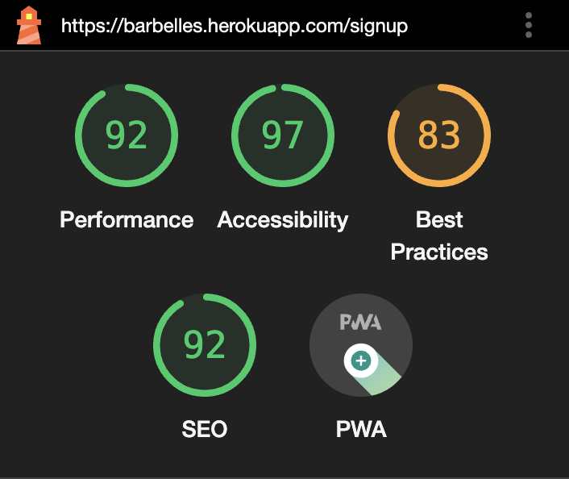

### Posts Page

*Desktop*

*Mobile*

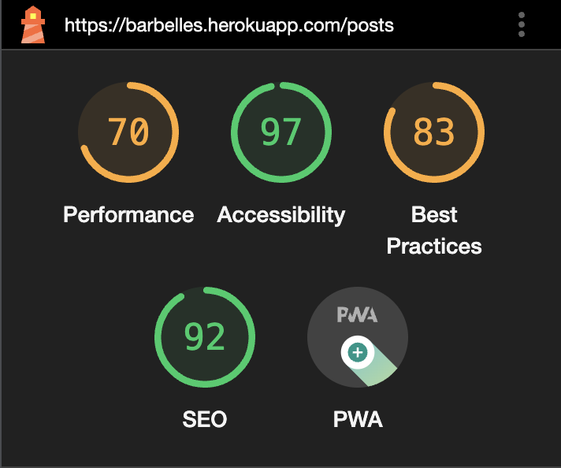

### Tutorials Page

*Desktop*

*Mobile*

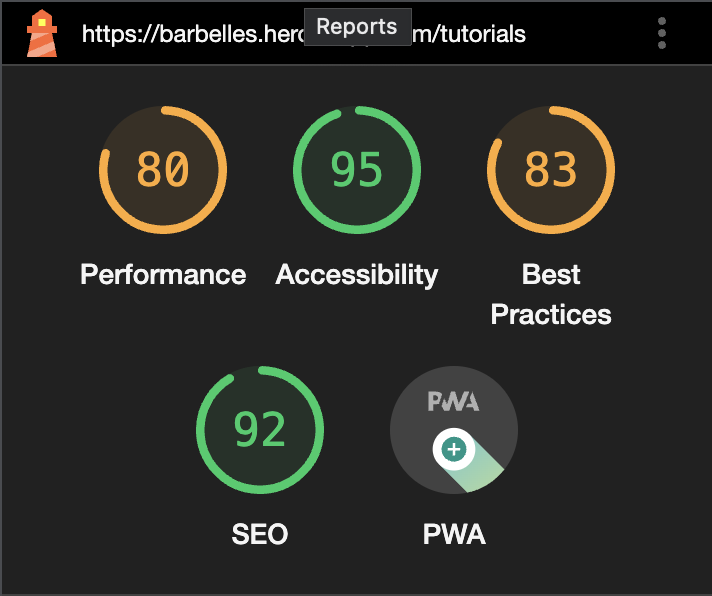

### About Page

*Desktop*

*Mobile*

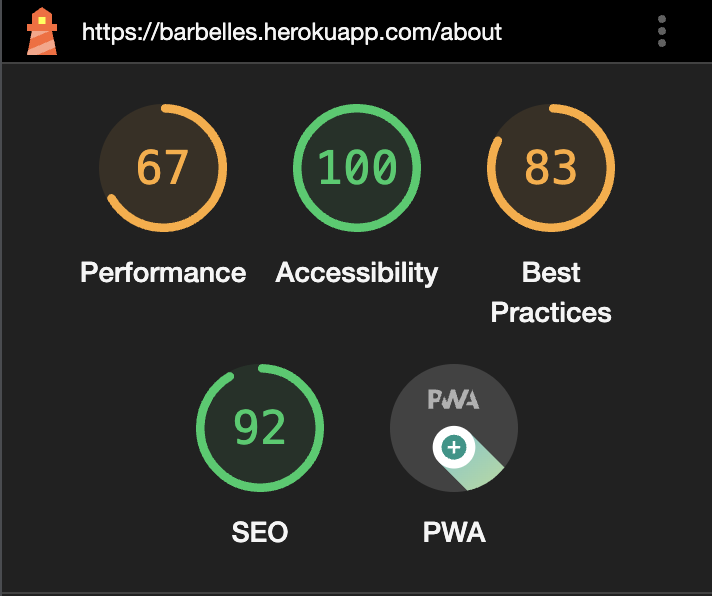

### Profile Page

*Desktop*

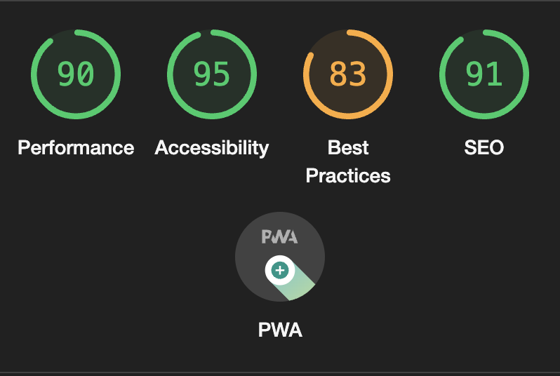

*Mobile*

### Post Share Page

*Desktop*

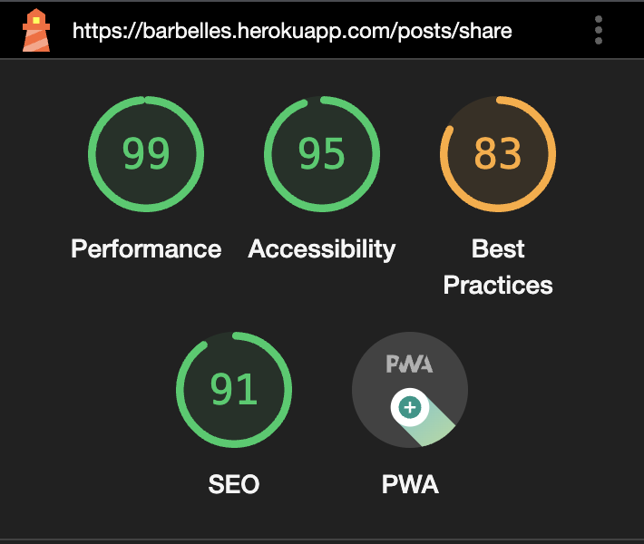

*Mobile*

### Post Detail Page

*Desktop*

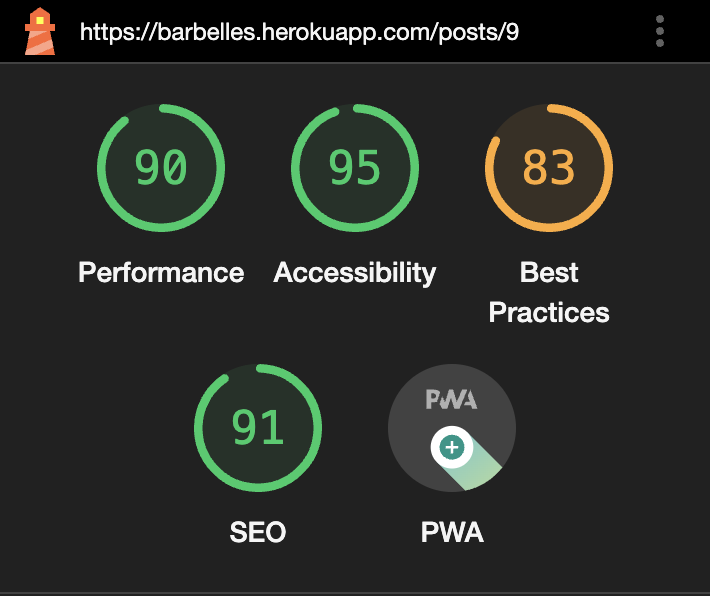

### Tutorial Detail Page

*Desktop*

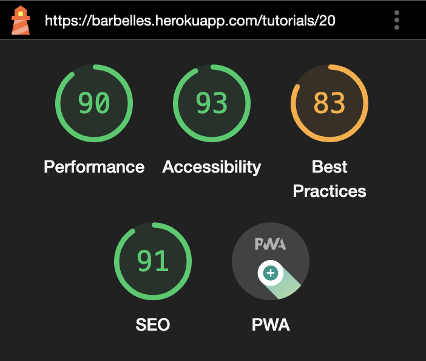

### Scores Summary

The Mobile scores are generally lower in terms of performance with the reason being some issues with the Bootstrap CDN and the images used. The majority of images added during development were already compressed to what I felt was an acceptable limit but images added by users were beyond my control. I had set a limit of 4MB via the back-end project so could perhaps have reduced this without compromising the UX. Some of the lower scores are as a result of the Cloudinary integration and issues with cookies which I feel were beyond my control here.

One major factor resulting in a widespread poor performance score relates to the resolution of the logo. If I had the time, I would revisit this but I found no visible issue with the appearance or performance of the logo itself.

## **Validation**

### **HTML**

The code for all pages was run through the [W3C HTML Markup Validation Service](https://validator.w3.org/).

Results from the validation can be seen below:

#### ***Home Page***

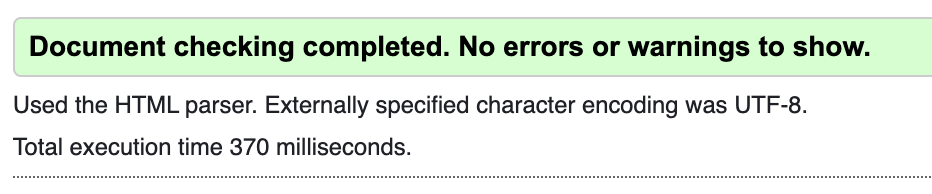

#### ***Posts Page***

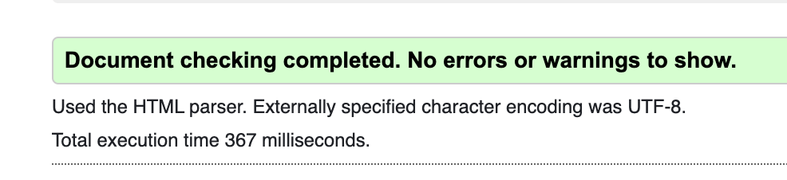

#### ***Tutorials Page***

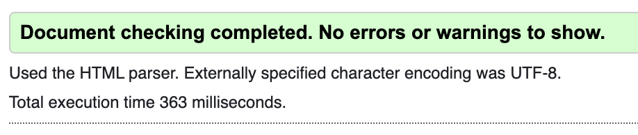

#### ***About Page***

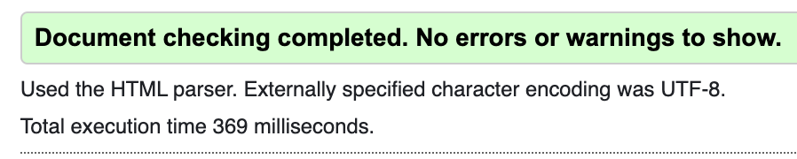

#### ***Profile Page***

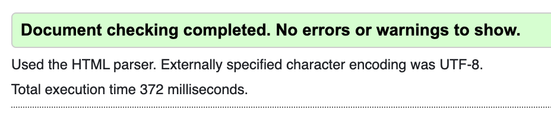

#### ***Post Detail Page***

#### ***Author Detail Page***

#### ***Share Post Page***

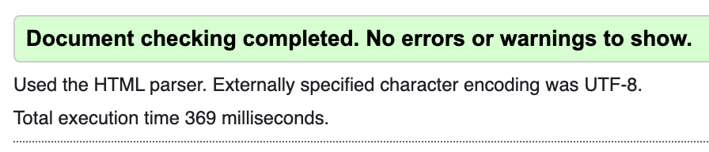

### ***CSS***

The custom CSS code for each module was passed through the [W3C Jigsaw Validator](https://jigsaw.w3.org/css-validator/). The results from the major pages can be seen below:

App.js
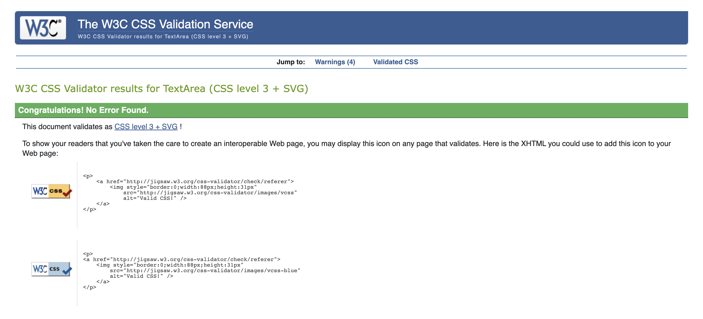

Home / Sign up / Sign in
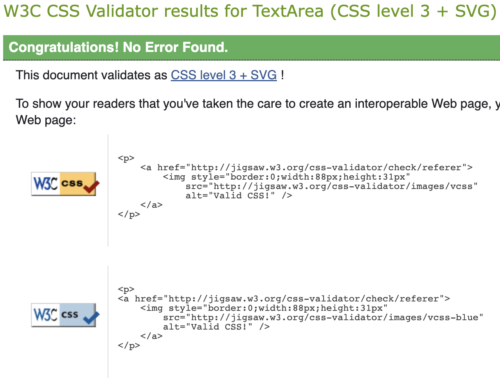

About

Posts
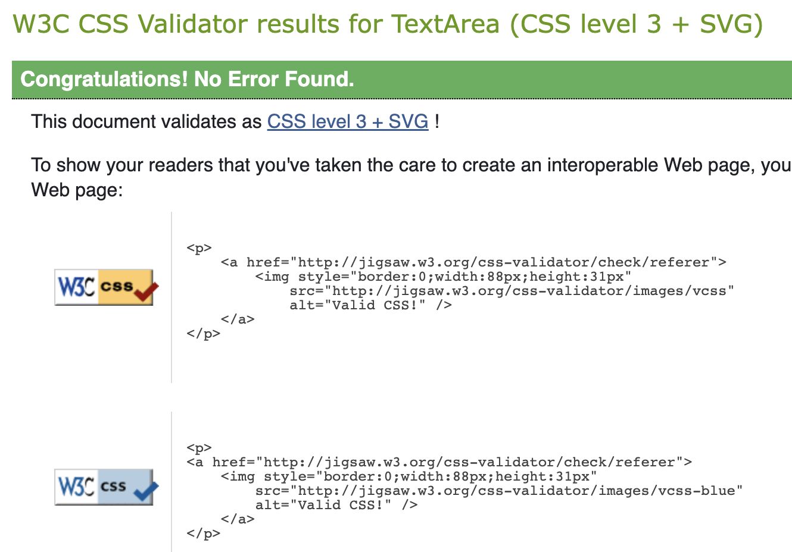

Tutorials
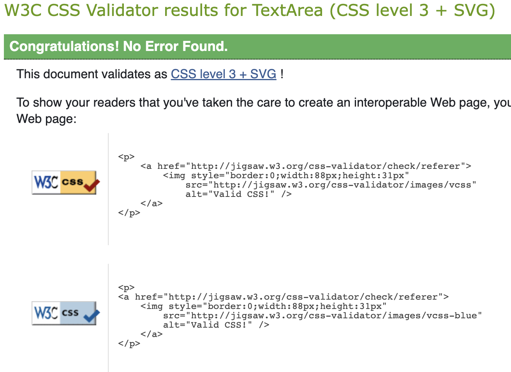

Post detail
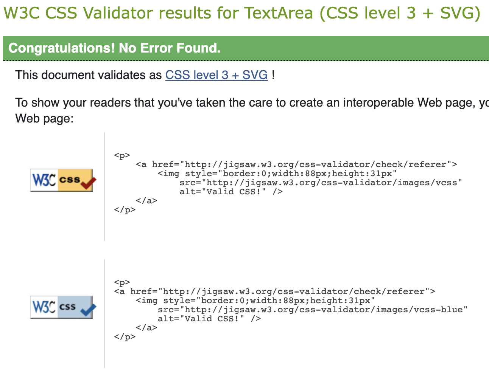

Tutorial detail
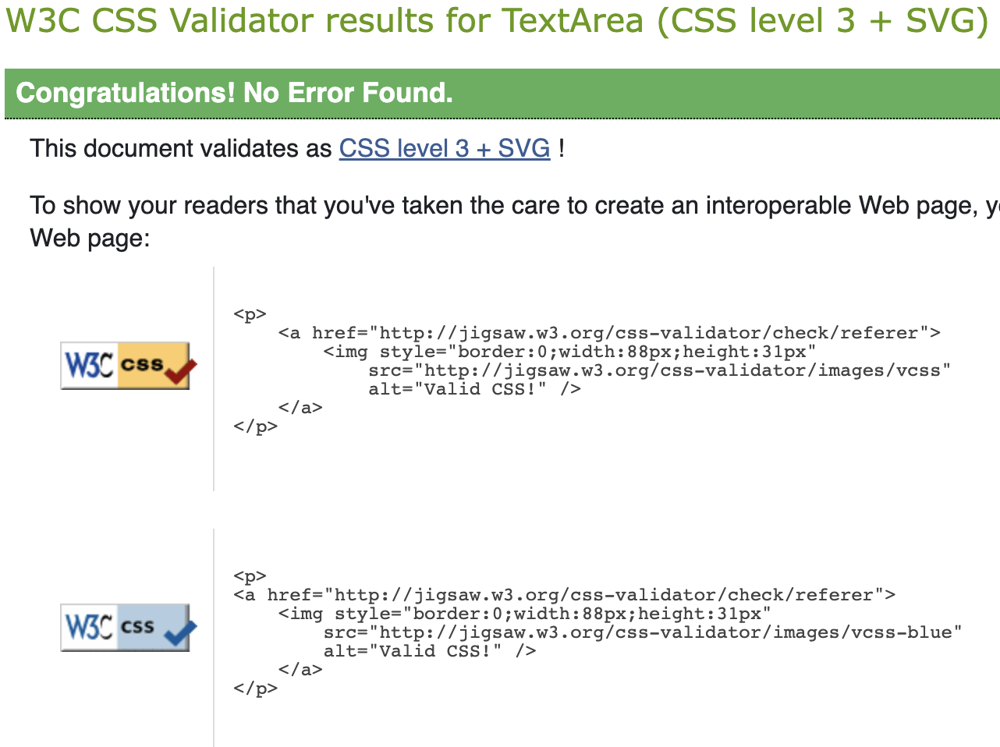

Profiles
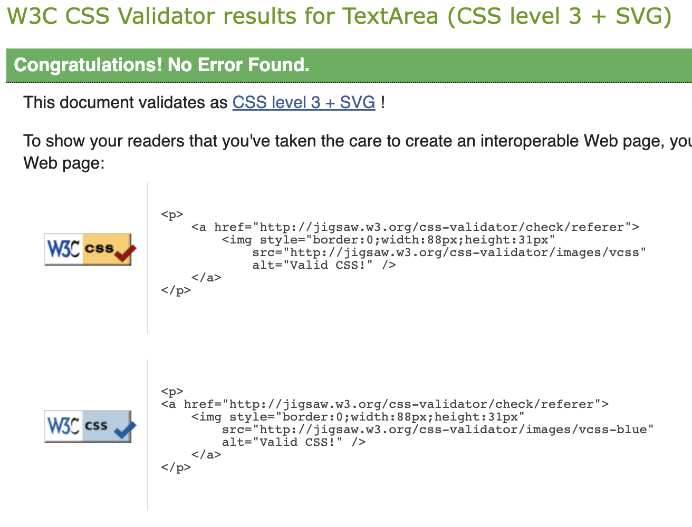

### ***JavaScript***

I used ESLintto test my code for the front-end. Unfortunately, it clashed with the development version of my project and the mouse would not work, nor would links function. Adding the code: `/* eslint-disable */` at the top of each page did not resolve this. The following issues were raised before I uninstalled ES lint, and have been ignored intentionally as they are in relation to code provided in the 'Moments' walkthrough project. I created rules to ignore the following in the eslint.rc file - and no further issues were raised:

* Do not pass children as props
* Props spreading is forbidden
* Do not nest ternary expressions
* Fragments should contain more than one child
* The use of apostrophes was flagged as an issue
* Minor instances relating to newlines, spaces and apostrophes were fixed when it did not impede the readability of the code.

## **Manual Testing**

### User Stories

#### As a Site Admin I can:

* User Story 📖: Create draft Book posts in order to publish them at a later time
* Test 🧪: The admin panel was used to create Test Book Reviews and set the status to either draft or published
* Result 🏆: The Book status was updated as intended
* Verdict ✅: Test passed.

 

* User Story 📖: Add to, or remove from, the Authors section in order to keep content fresh and relevant
* Test 🧪: The admin panel was used to add or remove authors along with date of birth, bios, images and famous works.
* Result 🏆: Creating and deleting authors functioned as intended.
* Verdict ✅: Test passed.

 

* User Story 📖: Delete a User account in order remove Users who do not respect who do not respect others in the community.
* Test 🧪: The delete User option was selected from the dropdown menu in the admin panel in order to delete Test Users
* Result 🏆: Users were deleted as intended.
* Verdict ✅: Test passed.

 

* User Story 📖: Approve or disapprove book reviews in order to check their content is appropriate.
* Test 🧪: Logging in as a Test User, I added a Book Review using the front end method. The Review did not appear in the Books page as the default setting was 'Draft'. By logging in as the Admin, I was able to set the status to 'Published' using the drop down menu.
* Result 🏆: The Book Review was approved and published as intended.
* Verdict ✅: Test passed.

 

* User Story 📖: Approve or disapprove comments in order to filter out objectionable content.
* Test 🧪: Logging in as a Test User, I added a comment to a Book Review. The confirmation message informed me the comment must be approved by the Admin. When I logged into the Admin panel, I was able to approve the comment or choose not to.
* Result 🏆: The comment was approved and posted to the relevant Book Review.
* Verdict ✅: Test passed.

 

* User Story 📖: View the number of likes on a post or comment in order to see which is the most popular.
* Test 🧪: Logging in as the Admin, I checked the Books list for the 'number of likes' field.
* Result 🏆: The field was not present.
* Verdict ❌: Test failed.
* Solution 🔍: Add 'number_of_likes' to BookAdmin list display in admin.py
* Verdict ✅: Test passed.

#### As an Unregistered Site User I can:

* User Story 📖: Easily determine the purpose of the site in order to see if I want to sign up to it.
* Test 🧪: Navigating to the Home Page I was presented with a simple, but attractive Home Page welcoming me to the site and a brief description that it was an online community devoted to Science Fiction literature
* Result 🏆: I found the appearance appealing and wanted to sign up.
* Verdict ✅: Test passed.

 

* User Story 📖: Register for an account in order to view and interact with content on the site.
* Test 🧪: Navigating to the Home Page I clicked the 'Register' button and was taken to the Sign Up Page. I tried entering invalid information and the Usernames I already knew existed.
* Result 🏆: Invalid data was not accepted, nor were duplicated Usernames. I was informed if passwords were too short or obvious. When the valid data was passed, registration was successful and I was logged in and redirected to the Home Page.
* Verdict ✅: Test passed.

#### As a Registered Site User I can:

* User Story 📖: Easily Log In to my account.
* Test 🧪: When logged out, I navigated to the Home Page and clicked the Log In button on the page.
* Result 🏆: I entered my details and clicked the Log In button to be redirected to the full Home Page. In subsequent visits, my devices had auto-filled the login fields and this provided an even smoother login experience.
* Verdict ✅: Test passed.

 

* User Story 📖: View a list of book posts in order to select one to read.
* Test 🧪: Logging in as a Test User, I navigated to the Books Section of the site to see a list of Book Reviews. 
* Result 🏆: The list of Books displayed in a paginated list of 6 as intended.
* Verdict ✅: Test passed.

 

* User Story 📖: Click on a Book Review in order to view all of its content
* Test 🧪: Logging in as a Test User, I navigated to the Books Section of the site to see a list of Book Reviews. I clicked on each review in order to view more details and the review itself.
* Result 🏆: When clicking on each review, I was able to view more about the Book and read the User's Book Review.
* Verdict ✅: Test passed.

 

* User Story 📖: Create posts of my own in order to share my review with the community.
* Test 🧪: Logging in as a Test User, I navigated to the Books Section of the site to see a list of Book Reviews. I clicked on the 'Submit Review' button and completed the form on the 'Add Book' page. I completed the form and uploaded an image.
* Result 🏆: Upon submission of the form, a message informed me the Review had been submitted for approval by the Admin. When logging in as Admin and approving the Review, it displayed on the Books page as intended.
* Verdict ✅: Test passed.

 

* User Story 📖: Edit or delete my book posts in order to keep my own contributions relevant.
* Test 🧪: When logged in, 'Edit' and 'Delete' buttons were present on reviews I had written on both the Books and Book Detail pages. Clicking 'Edit' directed me to the 'Edit Review' form which I could update accordingly. If I clicked 'Delete' I was asked for confirmation.
* Result 🏆: Submitting the Update Review form displayed a message informing me the review had been updated and the new content displayed. Confirming deletion removed the Book Review from the site and database.
* Verdict ✅: Test passed.

 

* User Story 📖: Comment on other users' posts in order to interact with the community.
* Test 🧪: Logging in as a Test User, I navigated to the Books Section of the site to see a list of Book Reviews. On the Book Detail page, I added a comment using the form at the bottom of the page and clicked 'Submit'. A message provided feedback and informed me the comment must be approved by the Admin.
* Result 🏆: Logging in as the Admin, I was able to approve the comment and it displayed on the corresponding Book Detail page as intended.
* Verdict ✅: Test passed.

 

* User Story 📖: Like or unlike posts and comments in order to interact with the site content.
* Test 🧪: Logging in as a Test User, I navigated to the Books Section of the site to see a list of Book Reviews. On the Book Detail page, I clicked the 'Like' button.
* Result 🏆: The outline heart icon changed to a solid red heart. If I clicked the button again, it reverted to the previous state.
* Verdict ✅: Test passed.

 

* User Story 📖: Add to and / or update my profile in order to keep my account up-to-date.
* Test 🧪: Logging in as a Test User, I navigated to the Profile Page and saw that the User Profile had been created automatically when registering. A card and hidden form were both pre-populated with the information I provided when registering. I completed the form and clicked 'Update' at the bottom of the page. 
* Result 🏆: Feedback was provided by a message informing me that the profile had been updated and the corresponding information was displayed in the card.
* Verdict ✅: Test passed.

 

* User Story 📖: Upload a profile image in order to express myself within the community.
* Test 🧪: On the Profile Page, I clicked the 'Edit Profile' button and added an image using the field in the form.
* Result 🏆: Feedback was provided by a message informing me that the profile had been updated and the corresponding photograph was displayed in the card.
* Verdict ✅: Test passed.

 

* User Story 📖: Easily Log Out of my account.
* Test 🧪: When logged in, I navigated to 'Log Out' in the Navbar or Hamburger Menu (depending on the device).
* Result 🏆:  Clicking the Log Out link took me to the Log Out page where I was prompted for confirmation I wanted to do so. Upon clicking the button I was logged out and redirected to the logged-out version of the Home Page. A message informed me I had successfully logged out.
* Verdict ✅: Test passed.

## **Additional Testing**

* Aim 🎯: Test 404 Page.
* Test 🧪: When logged in, I added random letters to the end of the URL. 
* Result 🏆:  The custom 404 page was displayed.
* Verdict ✅: Test passed.

Back to [README](/README.md)