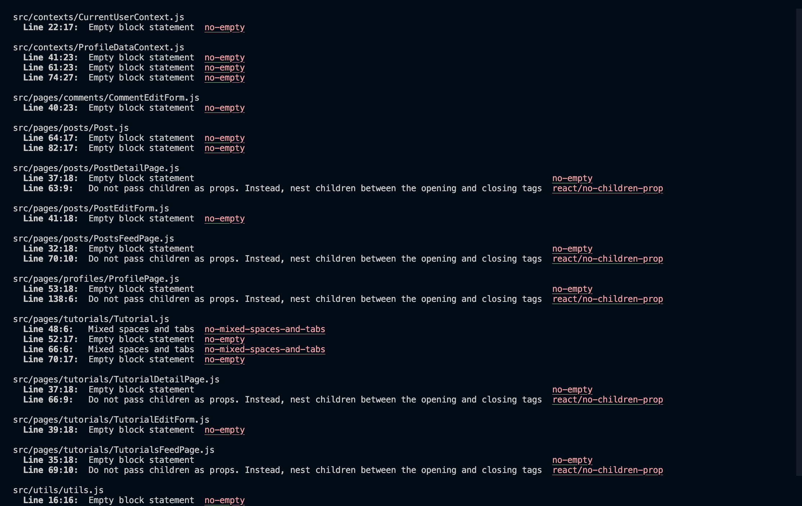
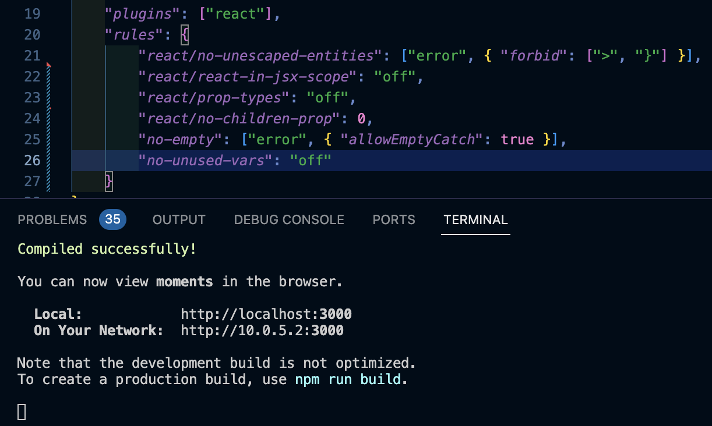

# Testing

* [**Testing Overview**](#testing-overview)
* [**Bugs**](#bugs)
* [**Lighthouse**](#lighthouse)
  * [**Home Page**](#home-page)
    * [*Desktop*](#home-desktop)
    * [*Mobile*](#home-mobile)
  * [**Posts Feed**](#posts-page)
    * [*Desktop*](#posts-desktop)
    * [*Mobile*](#posts-mobile)
  * [**Tutorials**](#tutorials-page)
    * [*Desktop*](#tutorials-desktop)
    * [*Mobile*](#tutorials-mobile)
  * [**About Page**](#about-page)
    * [*Desktop*](#about-desktop)
    * [*Mobile*](#about-mobile)
  * [**Profile Page**](#profile-page)
    * [*Desktop*](#profile-desktop)
    * [*Mobile*](#profile-mobile)
  * [**Post Detail**](#post-detail-page)
    * [*Desktop*](#post-detail-desktop)
    * [*Mobile*](#post-detail-mobile)
  * [**Tutorial Detail**](#tutorial-detail-page)
    * [*Desktop*](#tutorial-detail-desktop)
    * [*Mobile*](#tutorial-detail-mobile)
  * [**Share Post Page**](#share-post-page)
    * [*Desktop*](#share-post-desktop)
    * [*Mobile*](#share-book-mobile)
  * [**Edit Post Page**](#edit-post-page)
    * [*Desktop*](#edit-post-desktop)
    * [*Mobile*](#edit-post-mobile)
  * [**Scores Summary**](#scores-summary)
* [**Validation**](#validation)
  * [**HTML**](#html)
  * [**CSS**](#css)
  * [**JavaScript**](#javascript)
  * [**Python / Django**](#python--django)
* [**User Story Testing**](#user-story-testing)
* [**Automated Testing**](#automated-testing)
* [**Additional Testing**](#additional-testing)

## **Testing Overview**

At the time of writing this is the largest project I had undertaken so I felt the testing process needed to be as thorough as possible. The project was tested on a variety of devices including a MacBook Pro 2021, a MacBook Air 2020, an iPad Air 2020, iPhone 14 ProMax iPhone 12, iPhone SE, Dell Windows Desktop with 24" Screen, Kindle Fire and a Samsung Galaxy Tablet. The browsers used were Chrome, Safari and Edge.

The majority of User testing was conducted by myself, however I enlisted the help of family and the site owner, essentially to try to break the site or help me identify bugs and areas for improvement.

All buttons and links were clicked multiple times to test they functioned as expected. Multiple test posts, tutorials, comments and profiles were created, edited and deleted to check the efficacy of the CRUD (create, read, update and delete) functionality across the site. 

The social media links open to external pages as intended.

Inevitably there were bugs and these are outlined and summarised below.

Full details of manual testing can be found on this page.

## **Bugs**
​
The following bugs were identified during user testing:

* Bug 🐞 - Upon starting the workspace, an error message is displayed relating to the Node version.
* Cause ⚒️ - There is a conflict between the template and current version of Node.
* Resolution ✅ - In the terminal, enter: `nvm i 16` > `nvm use 16` > `npm start`.

 

* Bug 🐞 - Received an error in the terminal about a memory leak in the application when updating the profile.
* Cause ⚒️ - The error suggested using a clean-up function
* Resolution ✅ - Added a clean-up function to the useEffect hook in EditProfile.js

​ 

* Bug 🐞 - Signing out did not function as expected.
* Cause ⚒️ - I traced the error to a missing forward slash in the URL path in the API.
* Resolution ✅ - Corrected the typo.

​ 

* Bug 🐞 - The `nmp start` command no longer worked as expected, meaning I lost a full day of project-time.
* Cause ⚒️ - The error was on Gitpod's side as a result of an update to the Browser file.
* Resolution ✅ - Contacted Gitpod and was assured they were working on a solution. Hoped for a quick fix and fortunately the issue was resolved the following day.

​ 

* Bug 🐞 - The follow button would update the follow count but no longer follow or unfollow as intended
* Cause ⚒️ - Tutor support suggested that the database had somehow become corrupted.
* Resolution ✅ - Reset the database, re-connect the database and re-add site content.

 

* Bug 🐞 - Terminal errors when interacting with the app when logged-out. Specifically:
  - 401 errors on mount when not logged in
  - 401 errors when going to the sign/sign up page
  - 401 error when an access token has expired
* Cause ⚒️ - According to the Code Institute walkthrough project, these errors are normal and should be treated as feedback from the API.
* Resolution ✅ - Whilst the errors persist, it is reassuring to know these errors can essentially be disregarded for the purpose of this project.

​ 

* Bug 🐞 - Users were able to access edit- and share-post pages when not logged in.
* Cause ⚒️ - No defensive design present on these pages.
* Resolution ✅ - Used the useRedirect hook to redirect logged-out users to the sign-in page.

 

* Bug 🐞 - Could not connect to the API.
* Cause ⚒️ - Had not removed the trailing slash from the CLIENT_DEV url.
* ✅ - Corrected typo.

## **Unfixed Bugs**

* There is a known bug that this app cannot open on Apple mobile devices and most browsers other than Chrome. The bug is that when users try to log in, they will be redirected back to the login page. This bug is due to cookies not being saved in the local storage. For this bug to be fixed on Safari, "Prevent Cross-Site Tracking" will need to be turned off in settings. In the case of this app, I was able to use the app as intended on Safari on an iPhone 12, iPhone 14 Pro Max. It would not function as intended using Chrome iOS.

## **Lighthouse**

The Lighthouse test results for all major pages can be found below. 

### Home Page

*Desktop*

*Mobile*

### Posts Page

*Desktop*

*Mobile*

### Tutorials Page

*Desktop*

*Mobile*

### About Page

*Desktop*

*Mobile*

### Profile Page

*Desktop*

*Mobile*

### Post Share Page

*Desktop*

*Mobile*

### Post Detail Page

*Desktop*

### Tutorial Detail Page

*Desktop*

### Scores Summary

The Mobile scores are generally lower in terms of performance with the reason being some issues with the Bootstrap CDN and the images used. The majority of images added during development were already compressed to what I felt was an acceptable limit but images added by users were beyond my control. I had set a limit of 4MB via the back-end project so could perhaps have reduced this without compromising the UX. Some of the lower scores are as a result of the Cloudinary integration and issues with cookies which I feel were beyond my control here.

One major factor resulting in a widespread poor performance score relates to the resolution of the logo. If I had the time, I would revisit this but I found no visible issue with the appearance or performance of the logo itself.

## **Validation**

### **HTML**

The code for all pages was run through the [W3C HTML Markup Validation Service](https://validator.w3.org/).

Results from the validation can be seen below:

#### ***Home Page***

#### ***Posts Page***

#### ***Tutorials Page***

#### ***About Page***

#### ***Profile Page***

#### ***Post Detail Page***

#### ***Author Detail Page***

#### ***Share Post Page***

### ***CSS***

The custom CSS code for each module was passed through the [W3C Jigsaw Validator](https://jigsaw.w3.org/css-validator/). The results from the major pages can be seen below:

App.js

Home / Sign up / Sign in

About

Posts

Tutorials

Post detail

Tutorial detail

Profiles

### ***JavaScript***

I used [ESLint](https://eslint.org/)to test my code for the front-end. The following issues were identified:

* The empty block statements were intentional for this project as students had been asked to delete console.logs from catch blocks. This obviously left the empty blocks. I created a rule in the .eslintrc.json file to ignore these.

* I also created a rule to ignore "do not pass children as props", seeing that this method was related to and prevalent across the Code Institute 'Moments' walkthrough. I did research other methods of achieving the same results, but at the late stage of the project was reluctant to change anything.

* Minor instances relating to newlines, spaces and tabs were fixed and the errors resolved.

* There were also numerous instances of 'no-unused-vars' flagging React being imported but not used. Whilst being aware that recent versions of react do not require this import, I was reluctant to remove them seeing as the ES6 snippet had added the code in the first place. As these were the only unused variables, I turned off the warnings.

With the resolution of these final issues, the linter returned no warnings (the problems in the terminal in the image below all relate to spelling):

## **Manual Testing**

### User Stories

#### As a Site Admin I can:

* User Story 📖: Create tutorials
* Test 🧪: Using the API admin panel, set the specific profile.is_staff value to True. Log in on the front-end as that user.
* Result 🏆: The 'share tutorial' link is present in the navbar and the link works.
* Verdict ✅: Test passed.

 

#### As an Unregistered Site User I can:

* User Story 📖: Easily determine the purpose of the site in order to see if I want to sign up to it.
* Test 🧪: Navigating to the Home / sign up page and click on About link to view About page
* Result 🏆: The about page offers plenty of clear information about the purpose of the site.
* Verdict ✅: Test passed.

 

* User Story 📖: Register for an account in order to view and interact with content on the site.
* Test 🧪: Navigating to the Home Page I completed the sign up form. I tried entering invalid information and the Usernames I already knew existed.
* Result 🏆: Invalid data was not accepted, nor were duplicated Usernames. I was informed if passwords were too short or obvious. When the valid data was passed, registration was successful and I was logged in and redirected to the Home Page.
* Verdict ✅: Test passed.

#### As a Registered Site User I can:

* User Story 📖: Easily sign in to my account.
* Test 🧪: When logged out, I navigated to the Home Page and completed the sign in form.
* Result 🏆: I entered my details and clicked the submit button to be redirected to the posts feed page. In subsequent visits, my devices had auto-filled the login fields and this provided an even smoother login experience.
* Verdict ✅: Test passed.

 

* User Story 📖: View a list of posts in order to select one to read.
* Test 🧪: Logged-in users are directed to the posts-feed page which displays a list of posts. 
* Result 🏆: The list of posts displays as intended.
* Verdict ✅: Test passed.

 

* User Story 📖: View an infinite list of posts.
* Test 🧪: Created more than ten posts to test the infinite scroll functionality.
* Result 🏆: The list of posts displays and loads further posts as the user scrolls down the page.
* Verdict ✅: Test passed.

 

* User Story 📖: Click on a post in order to view all of its content
* Test 🧪: Logged in and clicked on all posts to view more detail.
* Result 🏆: Each click took me to the post detail page for that particular post
* Verdict ✅: Test passed.

 

* User Story 📖: See a list of posts by users I follow.
* Test 🧪: Logged in and randomly followed two users and checked their posts.
* Result 🏆: When clicking following in the Posts dropdown, I could see a list of posts by the two users I had followed.
* Verdict ✅: Test passed.

 

* User Story 📖: View posts I have liked or tutorials I have favourited.
* Test 🧪: Logged in and liked some random posts, favourited some tutorials. 
* Result 🏆: When navigating to the liked and favourited links, the pages had been populated with posts or tutorials I had liked.
* Verdict ✅: Test passed.

 

* User Story 📖: View a list of top profiles.
* Test 🧪: Logged in and expected to see profiles with the most followers in the top profiles component. 
* Result 🏆: The profiles displayed correctly, regardless of the device.
* Verdict ✅: Test passed.

 

* User Story 📖: Create posts of my own in order to share my fitness journey with the community.
* Test 🧪: Logging in as a Test User, I navigated to the share posts link in the Posts dropdown menu in the navbar.
* Result 🏆: Upon submission of the share post form, a toast informed me the post has been created successfully.
* Verdict ✅: Test passed.

 

* User Story 📖: Edit or delete my posts in order to keep my own contributions relevant.
* Test 🧪: When logged in, 'Edit' and 'Delete' buttons were present in a dropdown menu on posts I had created. Clicked 'Edit' and 'Delete'
* Result 🏆: Submitting the edit post form displayed a toast informing me the post had been updated successfully and the new content displayed. Upon deletion a post was removed from the site and a toast informed me the post had been deleted.
* Verdict ✅: Test passed.

 

* User Story 📖: Edit or delete my comments in order to make corrections and keep my own contributions relevant.
* Test 🧪: When logged in, 'Edit' and 'Delete' buttons were present in a dropdown menu on comments I had created. Clicked 'Edit' and 'Delete'
* Result 🏆: Submitting the edit comment form displayed a toast informing me the comment had been updated successfully and the new content displayed. Upon deletion a comment was removed from the site and a toast informed me the comment had been deleted.
* Verdict ✅: Test passed.

 

* User Story 📖: Search posts and tutorials by keyword or username.
* Test 🧪: When logged in, clicked in the search bar and typed keywords from post or tutorial titles and users who I knew had created those.
* Result 🏆: Results displayed as expected.
* Verdict ✅: Test passed.

 

* User Story 📖: Easily ascertain whether I am logged in or not.
* Test 🧪: Test links present when logged out vs logged in.
* Result 🏆: When logged out, I was unable to interact with any site content. When logged in, I could see my avatar in the top right hand side of the page in the navbar and I was able to interact with the content.
* Verdict ✅: Test passed.

 

* User Story 📖: Comment on other users' posts or tutorials added by the staff, in order to interact with the community.
* Test 🧪: Logging in as a Test User, I navigated to a post. I typed a comment and clicked post. I repeated this for the tutorials.
* Result 🏆: The comments were added and a toast provided confirmation of this.
* Verdict ✅: Test passed.

 

* User Story 📖: Like or unlike posts and tutorials in order to interact with the site content.
* Test 🧪: Logging in, I navigated to various posts and tutorials and clicked like or favourite. I repeated this process for the tutorials.
* Result 🏆: The outline heart icon changed to a solid red heart in the posts. If I clicked the button again, it reverted to the previous state. In the tutorials, the icon changed from the bookmark outline to the solid one and back again.
* Verdict ✅: Test passed.

 

* User Story 📖: Add to and / or update my profile in order to keep my account up-to-date.
* Test 🧪: Logging in, I navigated to the Profile Page and saw that the User Profile had been created automatically when registering. I tried to add a profile image, name and bio and click submit.
* Result 🏆: Feedback was provided by a toast informing me that the profile had been updated and the corresponding image and information was displayed in the profile.
* Verdict ✅: Test passed.

 

* User Story 📖: Update username and password in order to keep my account secure.
* Test 🧪: Logging in, I navigated to the Profile Page and selected edit username and edit password from the dropdown menu.
* Result 🏆: Username and password were updated accordingly and this was confirmed when logging in with the new details.
* Verdict ✅: Test passed.

 

* User Story 📖: Easily sign out of my account.
* Test 🧪: When logged in, I navigated to 'Log Out' in the Navbar or Hamburger Menu (depending on the device).
* Result 🏆:  Clicking the Log Out button triggered a sign out modal asking for confirmation. I was able to sign out or cancel. If I clicked sign out I was redirected to the home page and a toast informed me I had logged out successfully.
* Verdict ✅: Test passed.

 

* User Story 📖: Easily sign out of my account.
* Test 🧪: When logged in, I navigated to 'Log Out' in the Navbar or Hamburger Menu (depending on the device).
* Result 🏆:  Clicking the Log Out button triggered a sign out modal asking for confirmation. I was able to sign out or cancel. If I clicked sign out I was redirected to the home page and a toast informed me I had logged out successfully.
* Verdict ✅: Test passed.

## **Automated testing**

Some automated testing was performed on the following components:

- Asset.js
- Navbar.js
- SignIn.js
- SocialLinks.js
- Welcome.js

These tests all pass and can be found in the tests folder located in the components directory.

## **Additional Testing**

* Aim 🎯: Test 404 Page.
* Test 🧪: When logged in, I added random letters to the end of the URL. 
* Result 🏆:  The custom 404 page was displayed.
* Verdict ✅: Test passed.

Back to [README](/README.md)